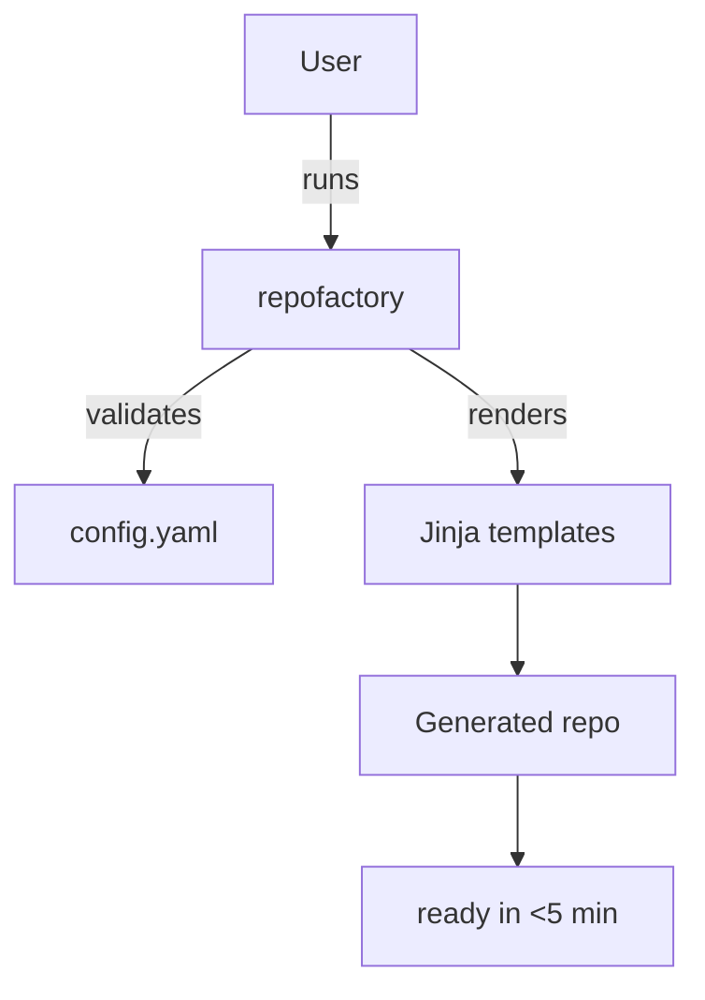

# repo-factory 🏭

CLI to spin up production-ready repos from a tiny YAML config in under 5 minutes.


## What it does
Turns `config.yaml` into a complete repo: README, LICENSE, Makefile, CI, lint/test hooks, docs skeleton, and optional Dockerfile — all templated for Python or Node.

## Who it’s for
- Solo builders who need clean repos fast
- Teams standardizing scaffolds
- Hackathon projects with zero setup time
- CI-minded folks who want lint/tests from day one

## Features
- YAML-driven: `name`, `type`, `language`, `features`
- Types: library, cli, api, saas-lite, research
- Languages: Python 3.11 or Node 20 templates
- Built-in CI (GitHub Actions), lint/test hooks, MIT license, docs skeleton
- Optional Dockerfile, docs, lint/test configs
- Jinja templating for easy extension
- Example generated repos committed in `examples/output`
- Validated configs with clear errors

## Quickstart
```bash
# 1) Setup
make setup

# 2) Generate a repo
.venv/bin/repofactory build config.example.yaml --out ./generated

# 3) Inspect
ls generated

# 4) Run demo (regen examples/output/demo)
make demo
```

## Example output
```
examples/output/demo
├── .github/workflows/ci.yml
├── .gitignore
├── LICENSE
├── Makefile
├── README.md
├── docs/
├── pyproject.toml
└── src/
```

## How it works

More details in [docs/ARCHITECTURE.md](docs/ARCHITECTURE.md).

## Configuration
See [docs/CONFIG.md](docs/CONFIG.md) or `config.example.yaml`.

## Contributing
See [CONTRIBUTING.md](CONTRIBUTING.md).

## License
[MIT](LICENSE)
