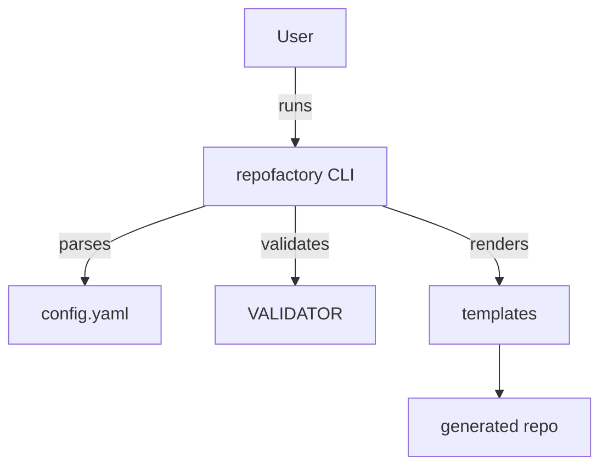

# Architecture

- Validation checks required fields and allowed values.
- Templates are Jinja-based per language/type; base assets cover LICENSE, README, CI.
- Features toggle extra assets (Dockerfile, lint configs, docs).
