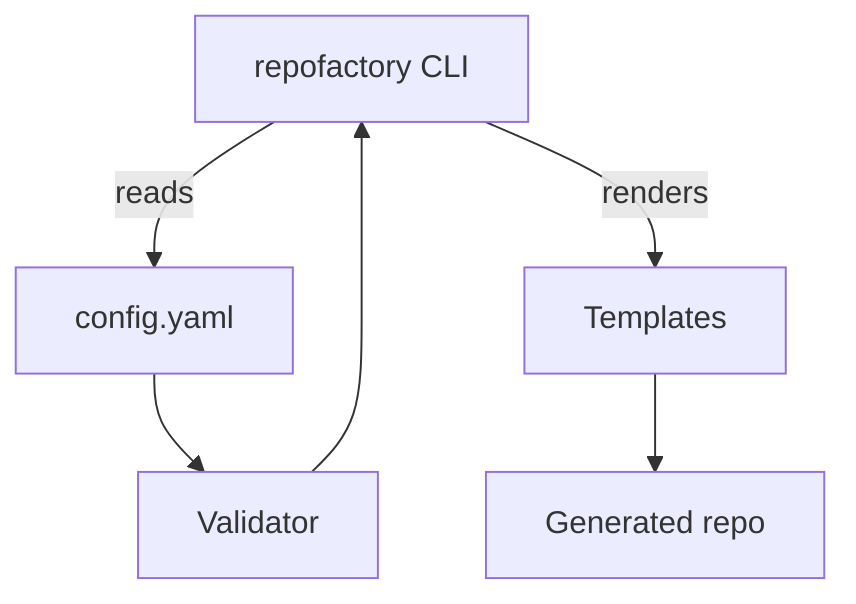

# Architecture

```mermaid
graph TD
  CLI[repofactory CLI] -->|reads| CFG[config.yaml]
  CLI -->|renders| TPL[Templates]
  TPL --> OUT[Generated repo]
  CFG --> VALIDATOR[Validator]
  VALIDATOR --> CLI
```

Data flow: config -> validation -> template rendering -> files -> optional extras (Docker, CI, docs).